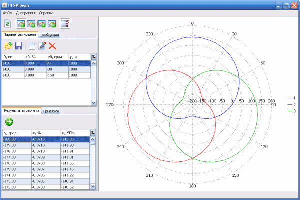

**PLSViewer**

Pipeline Lengthwise Stress Viewer

Calculation of longitudinal mechanical stresses and deformations at any point of the pipeline cross-section based on data on the outer diameter of the pipeline, the longitudinal strain of tension (compression), the bending radius of the pipeline, the angular position of the line where the stresses associated with the bend are zero. Visualization of calculation results in a polar or rectangular coordinate system.

